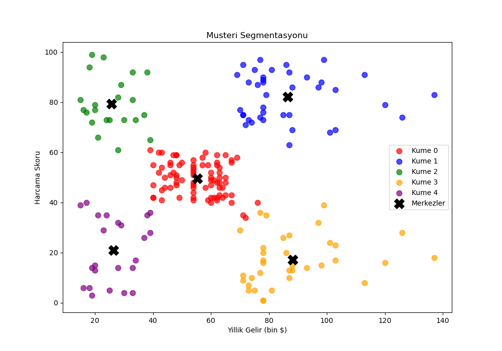
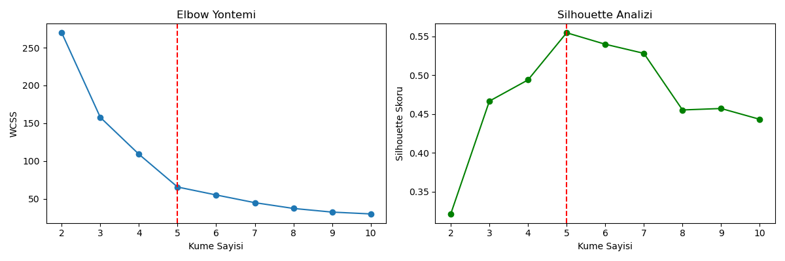

# Müşteri Segmentasyonu

AVM müşterilerini yıllık gelir ve harcama alışkanlıklarına göre gruplayan bir makine öğrenmesi projesi.



## Ne Yapıyor?

200 müşteriyi analiz edip benzer davranış gösterenleri 5 gruba ayırıyor. Böylece her gruba farklı pazarlama stratejisi uygulanabilir.

## Veri Seti

[Kaggle - Mall Customers](https://www.kaggle.com/datasets/vjchoudhary7/customer-segmentation-tutorial-in-python)

| Özellik | Açıklama |
|---------|----------|
| Yaş | 18-70 arası |
| Yıllık Gelir | 15k$ - 137k$ |
| Harcama Skoru | 1-100 arası (AVM'nin verdiği puan) |

## Yöntem

**K-Means Kümeleme** kullandım. Optimal küme sayısını bulmak için:

- Elbow Method
- Silhouette Score



k=5'te en iyi sonucu aldım (Silhouette: 0.55)

## Sonuçlar

| Küme | Gelir | Harcama | Yorum |
|------|-------|---------|-------|
| 0 | Orta | Orta | Standart müşteriler |
| 1 | Yüksek | Yüksek | Premium segment |
| 2 | Düşük | Yüksek | Harcamayı seven gençler |
| 3 | Yüksek | Düşük | Tutumlu zenginler |
| 4 | Düşük | Düşük | Bütçe bilincli grup |

## Kurulum

```bash
pip install -r requirements.txt
python musteri_segmentasyonu.py
```

## Dosyalar

```
├── musteri_segmentasyonu.py   # Ana kod
├── Mall_Customers.csv         # Veri seti
├── sonuc.csv                  # Küme etiketli çıktı
├── 1_veri_dagilimi.png
├── 2_gelir_harcama.png
├── 3_optimal_k.png
└── 4_kumeleme.png
```

---

**Ahsen Yenisey** - ahsenyeuisei@gmail.com
